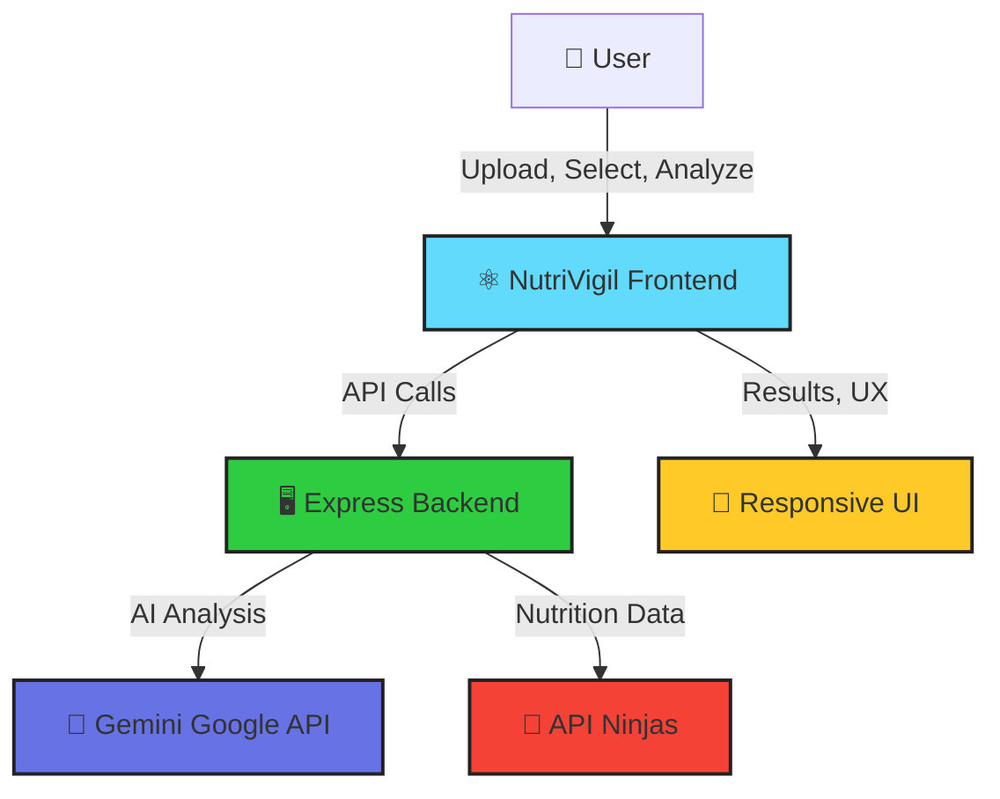

<!-- HEADER BANNER -->
<p align="center">

</p>

<p align="center">
  
  
  
  
</p>

---

<p align="center" style="font-size:1.3em">
  <strong>🥗 NutriVigil: Upload. Analyze. Decide. Eat Wisely.</strong><br>
  <em>Your next-gen app for food image analysis and custom health safety guidance.</em>
</p>

---

<div align="center">
  
  &nbsp;
  
</div>

---

## 🚀 Why NutriVigil?

> 

- 🍽️ **AI Food Analysis:** Snap/upload food, get smart analysis via Gemini API.
- 🩺 **Personalized Safety:** Choose conditions (Diabetes, Hypertension, etc.), receive customized warnings & insights.
- 🚦 **Traffic Light System:** See immediate safety status—green, yellow, or red—at a glance.
- 📋 **Detailed Recommendations:** Nutrition facts plus actionable health suggestions.
- 📱 **Modern UI:** Mobile-first, smooth & responsive experience.

---

## 🛠️ Tech Power-Ups

| Frontend              | Backend                    | Integrations           |
|:---------------------:|:-------------------------:|:---------------------:|
| ⚛️ React (Vite)       | 🖥️ Node.js + Express      | 🤖 Gemini AI (Google) |
| 🎨 Modern CSS         | 🔗 Multer (uploads)       | 🥗 API Ninjas (Nutrition) |
| 🗂️ Lucide Icons       | 🧠 AI-driven Analysis     | 🔒 Axios (API calls)  |


---

## 🗺️ Architecture Flow



---

## 🌐 Project Structure

```shell
NutriVigil/
 ├─ client/      # React + Vite + Modern CSS (Frontend)
 ├─ server/      # Node.js + Express + Multer (Backend)
 └─ README.md
```

---

## ⚡ Quickstart

```bash
# 1. Clone
git clone https://github.com/<your-username>/NutriVigil.git && cd NutriVigil

# 2. Install dependencies
cd client && npm i
cd ../server && npm i

# 3. Configure .env in server (see .env.example for secrets)

# 4. Run
cd client && npm run dev
cd ../server && npm run dev
```

---

## 🔑 API Keys Required

1. **Gemini API Key**: Get yours from [Google AI Studio](https://makersuite.google.com/app/apikey)
2. **API Ninjas Key**: Get yours from [API Ninjas Nutrition](https://api-ninjas.com/api/nutrition)

---

## 💡 Inspired By

> 

---

## ✨ Features

- 📤 Upload food images for AI-powered analysis
- 🏷️ Select health conditions (Diabetes, Hypertension, etc.)
- 🧠 Get smart nutritional breakdown & traffic light status
- 🗒️ Receive tailored recommendations and suggestions

---

## 🧰 Tech Stack

**Backend:**
- Node.js
- Express
- Multer (file uploads)
- Google Gemini 2.5 pro (AI)
- API Ninjas (nutrition data)
- Axios

**Frontend:**
- React
- Vite
- Axios
- Lucide React
- Modern CSS (mobile-first)

---
````
